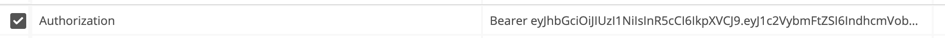

# ByWays Frontend Assessment

Hey there we would you to build small app that captures some of existing functionalities.

**We already initiated the React project for you (in Typescript)**

Goal of this exercise  is to assess your skill level with FrontEnd technologies

## General instructions
* Create new branch from `master`
* Commit as often as possible 
* And create a PR (pull/merge request) the end  

## Tasks
* Build Authentication page (Login screen)
  * Bonus points
    * Validate user input and show feedback
    * Handle error messages from API (server) side
    * If user is already logged in, do not allow user to land on this page
* Get user details after login
  * Bonus points
    * Since JWT is something that you would need for every request find some clean way to achieve this
* Build Transport list page
  * Bonus points
    * Implement status filter (tabs) via API (status param - see API docs bellow)
    * Implement search via API (search param - see API docs bellow)
    * If status is already applied (Requested tab is selected) and user searches event status should be included in that request
    * If result set is empty show user an empty state screen (ex: "Sorry we could not find any events that match given query")
* Build Single event
  * Bonus Points
    * if user tries to access non-existing event, show error page (server will return 400, and error message) 
* Log out
  * Bonus points
    * User should be redirected to the Login screen


## UI
Try to follow given raw UI mockup in `mockup.png` 


## Server Docs
(postman collection link https://www.getpostman.com/collections/eb1450c99b0c63984e61)

### Data types

#### User
```ts
  {
    username: string
    password: string
    email: string
    firstName: string
    lastName: string
  }
```

#### Event
```ts
  {
    id: number
    from: string
    to: string
    transportId: string
    status: string
    loadingCapacity: number | null
    loadingDuration: number | null
    loadingStart: Date | null
    loadingEnd: Date | null
    rampFree: Date | null
    estimatedArrivalTime: Date | null
    actualArrivalTime: Date | null
    purchaseOrderId: string
    truckLicensePlate: string | null
    trailerLicensePlate: string | null
    additionalInformation: string
    scheduledFrom: Date | null
    scheduledTo: Date | null
    carrierCompany: {
      companyName: string
      contactEmail: string
      contactPhone: string
    },
    ramp: {
      name: string
    }
    
    warehouseId: number
    loadingType: {
      id: 3
      name: string
      comment: string
    }
  }
```

### Error Responses
* Unauthorized (status: 401)
  ```{"message":  string}```
* Bad Request (status: 400)
  ```{"message":  string}```
* Validation error (status: 422)
  `{
    message: string,
    errors: {
        [field: string]: string
    }`
### Authentication
**With every request except /login UI must send TOKEN as authorization header with "Bearer " prefix**

_example:_


### Login
(Valid credentials: **username: warehouseAdmin, password: Test_1234**)

* url `http://localhost:3001/login`
* method: `POST`
* payload ```{
  username: string
  password:  string
  }```
* response ```{
  "token": string
  }```

### Me
* url `http://localhost:3001/me`
* method: `GET`
* response ```User```

### Event List

* url `http://localhost:3001/events`
* method: `GET`
* query params `search: string, status: string`
* response ```Event[]```

_example: http://localhost:3001/events_

_example with filters: http://localhost:3001/events?status=requested&search=cy_


### Single Event

* url `http://localhost:3001/events/:id`
* method: `GET`
params `id: number`
* response ```Event[]```

_example: http://localhost:3001/events/2132_

## Available Scripts

In the project directory, you can run:

### `yarn start`

Runs the app in the development mode.\
Open [http://localhost:3000](http://localhost:3000) to view it in the browser.

The page will reload if you make edits.\
You will also see any lint errors in the console.

## Start Server (change directory to `server`)

### `yarn`
### `yarn start`

Runs the server in the development mode.\
Open [http://localhost:3001](http://localhost:3001) to view it in the browser.

### server config (to modify change server/config.ts)
```ts
 {
  port: 3001
  publicUrl: 'http://localhost:3000'
}
```


